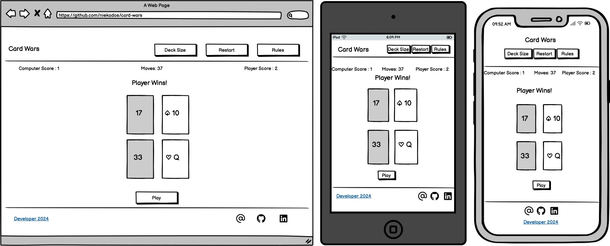
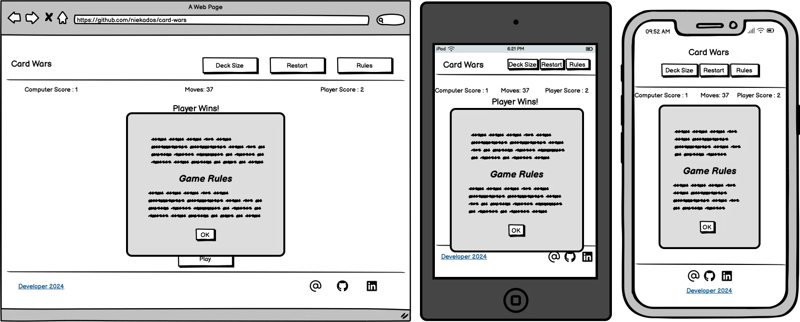
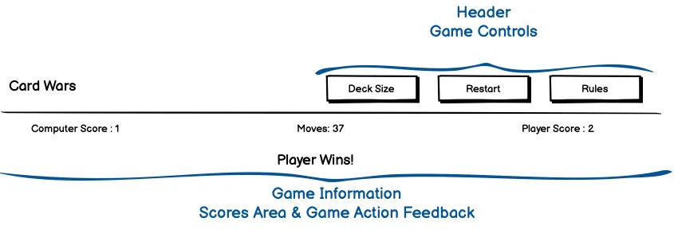
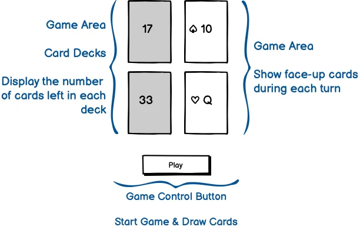
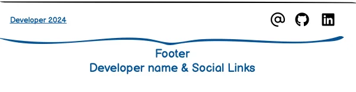
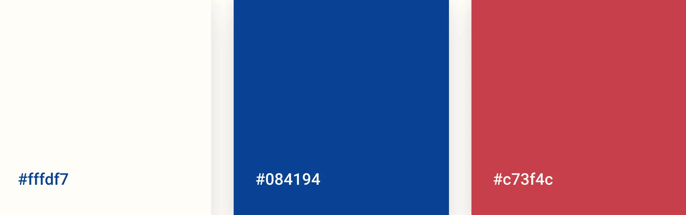

# Card Wars

Card Wars is a simple card game that brings back memories of my childhood. It was the first card game I learned to play, and it quickly became my favourite. It's easy to learn with basic rules, and matches can be very entertaining, although they can last an eternity. I want to recreate my childhood experience for myself and to share it with others, especially with little ones! It can be challenging to find an adult opponent with the patience or a parent with the time to play these lengthy matches with their children, so why not entrust this task to the most patient opponent of all - the computer!

## Game Rules

**Objective:**
- To win all the cards by the end of the game.

**Setup:**
- Each player has a separate deck of cards. Black cards are dealt to one player and red cards to the other.

**Gameplay:**
- Players take turns flipping over one card at a time from the top of their decks and placing them face-up in the middle of the playing area.
- The player with the higher card wins the round. If both cards are of the same value, it results in a "war."
- In the case of a war, each player places another set of cards face-up over the cards in the war.
- In case the cards are equal again, another "war" happens on top of the cards already in the war.
- The player who wins the war collects all the face-up cards in the middle of the playing area and places them at the bottom of their deck.
- If a player runs out of cards during a war, they lose the game. Otherwise, the game continues until one player wins all the cards.

## Startegy

This project aims to develop a simple, browser-based card game called "Card Wars." The game is designed to be playable by both adults and children, offering a fun and educational experience. It's a single-page application that features basic game controls and clear feedback for players.
The game will display the cards and decks, allowing players to make moves and receive instant feedback. Additionally, there will be a simple progress indicator to keep track of the game's progression.
The main goal of the project is to create an entertaining and educational game for all ages. It's a great way for kids to learn the rules of "Card Wars" while providing adults with a nostalgic trip down memory lane. The game aims to provide hours of enjoyment for players of all skill levels.

## Target Audience

The target audience for the game includes both adults and children who enjoy card games. The game is designed to be educational and entertaining, providing a fun experience for players of all ages.

## User Stories

New users of the game would like to:
- Easily learn the rules of the game.
- Play "Card Wars" and enjoy a fun gaming experience.
- Receive clear feedback on their actions during the game.
- Be able to track their progress in the game.
- Control their gaming experience.
- Explore other projects created by the developer or contact the developer.

Returning users would like to:
- Have a quick reminder of the game rules.
- Continue to play and enjoy "Card Wars."
- Experience the same simple controls and feedback as before.
- Easily track their progress in the game.
- Explore other projects by the developer or get in touch with the developer.

## Scope

The scope of "Card Wars" is to develop an immersive web-based card game that caters to players of all ages, ensuring a user-friendly and engaging experience. Upon loading the page, new users will be greeted with comprehensive game rules to familiarize themselves with the gameplay and understand the basics. The game will feature a clean interface with easy-to-use controls, allowing players to start or restart the game with ease. Essential features, such as access to game rules via a dedicated button, will be readily available to enhance user experience.

To emulate the experience of a traditional card game, the game's cards and decks will be prominently displayed on the screen, providing a realistic and interactive gameplay environment. The game will have a simple and playful design, resembling a hand-drawn game created with a fountain pen on paper, to capture the imagination of players and create a nostalgic feel.

The design will prioritize simplicity to ensure it is understandable for children while maintaining a playful aesthetic to sustain their interest. Additionally, the game will include social links for players to easily contact or research the developer, adding a sense of community and support.

Incorporating one page with a few pop-ups, such as game rules or notifications for winning or losing a match, will provide a seamless and immersive gaming experience. The design simplicity will not only enhance usability but also contribute to a fun and engaging gameplay.

## Structure

### Desktop
The "Card Wars" game will be structured as a single-page application, with a focus on simplicity and intuitive gameplay controls. The main components of the game's structure include:

- **Header:** The header will feature the game's logo on the left and game control buttons on the right. The logo will serve as a link to reload the page, while the control buttons will include options to restart the game, choose the deck size, and access the game rules via a pop-up. This layout will ensure easy access to key game features while maintaining a clean and organized interface.
- **Game Information Section:** Below the header, there will be a game information section that displays game progress and feedback for each move made by the player. This section will provide real-time updates on the game's status, allowing players to track their progress and make informed decisions.
- **Main Page Section:** The main page section will include the game decks on the left, with cards face down, and the game cards on the right, with cards face up. Computer cards will be displayed on top, and player cards will be displayed below the computer's cards. The play button will be positioned at the bottom, below the player's cards, to allow for easy access and gameplay.
- **Footer:** The footer will feature social links, allowing players to connect with the developer on various social media platforms. This will provide players with an opportunity to engage with the developer and stay updated on game updates and news.

### Responsive Design
In the "Card Wars" game, the header and footer sections will transform to ensure a seamless experience on smaller screens.

- **Header:** On small screens, the header will be displayed in a column layout, with the logo centered at the top of the screen. The game control buttons will be positioned below the logo, with smaller buttons to fit the screen size. This layout will maintain the functionality of the header while optimizing the user experience for smaller screens.
- **Footer:** Similarly, the footer will transform into a column layout on small screens. The social links will be displayed in a row at the top of the column, followed by the developer's name in a row at the bottom. This layout will ensure that all elements of the footer remain visible and accessible on smaller screens, enhancing the overall user experience.

## Skeleton

### Wireframes

### Main Page

### Popup window

### Header

### Game Area

### Footer

## Surface

### Fonts

- **Swanky and Moo Moo:** A Google Font designed by Kimberly Geswein, utilized for both the logo and the font of the playing cards. Its handwritten style contributes to the page's aesthetic, enhancing the card game's nostalgic appeal.

- **Playpen Sans:** Another Google Font designed by TypeTogether, Laura Meseguer, Veronika Burian, and José Scaglione, chosen as the main font for the webpage. Its handwriting-like qualities blend well with the game's theme while maintaining excellent readability across all elements of the page.

### Colours

 

 This project has been designed to replicate the essence of a hand-drawn, nostalgic card game experience. Colours were selected to reflect this and to evoke the feeling of playing with cards in your exercise book.

 - **#fffdf7** - A faint whisper of cream, with a predominance of pure white. The hue of a well-loved exercise book was chosen to represent the body of the page background and the cards.
 - **#084194** - This deep blue is reminiscent of the ink used in traditional pen and paper games. It has a strong contrast ratio of 9.41 with the paper's white background, ensuring great readability.
 - **#c73f4c** - Like a splash of red ink from a fountain pen, this subdued red adds just the right amount of contrast and visual interest. It's exclusively reserved for the red card suits and offers a contrast ratio of 4.86 with the paper white background.

## Deployment
This project was saved and stored on [GitHub](https://github.com/). GitHub has "git" version control and deployment through the GitHub Pages option.
To deploy your project to GitHub Pages:
- Go to your GitHub repository.
- Click on the "Settings" tab.
- Scroll down to the "Pages" section.
- Under the “Build and deployment” source drop-down menu select “Deploy from a branch”.
- Under the “Branch” drop-down menu, select “main” branch.
- Click "Save." (It may take a few minutes for the GitHub Pages to deploy).
- GitHub Pages will provide you with a link to your deployed website. The Deployed website address pattern is usually: "https://yourusername.github.io/your-repository/".

## Technologies Used
- JavaScript - a programming language commonly used to create dynamic, interactive web pages.
- CSS - Cascading Style Sheets is a style sheet language used for specifying the presentation and styling.
- HTML - HyperText Markup Language is a markup language that defines the content and structure of web content.
- [GitPod](https://www.gitpod.io/) - cloud development environment. 
- [Balsamiq](https://balsamiq.com/) - low-fidelity wireframing tool.
- [RedKetchup Favicon Generator](https://redketchup.io/favicon-generator) - to generate Favicon from an emoji.
- [Google Fonts](https://fonts.google.com/) - used to add fonts to the logo, navigation links and main content.
- [Colour Contrast Checker](https://colourcontrast.cc/) - colour contrast checker for the background and fonts.